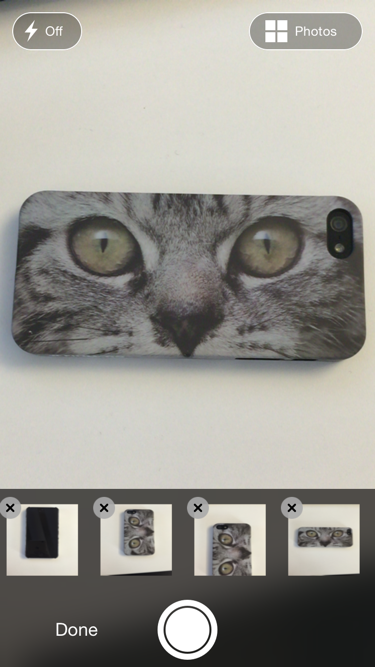

## Finjinon

Finjinon is a custom AVFoundation based camera UI, focused on quickly adding several photos. Selecting existing photos from the camera roll is supported through a pluggable interface, a default implementation using UIImagePickerController is provided.

Captured images are provided as an `Asset` which can retrieve image data asynchrously in order to keep memory usage low.

* Quickly capture multiple photos (not bursted though)
* Remove photos
* Adapter based photo picking from photo library
* Drag to reorder captured photos (longpress on thumbnail to initiate)

## Requirements

* iOS7+
* Swift 1.2

## Code Example

        let controller = PhotoCaptureViewController()
        controller.delegate = self
        presentViewController(controller, animated: true, completion: nil)
        
        extension ViewController: PhotoCaptureViewControllerDelegate {
            func photoCaptureViewController(controller: PhotoCaptureViewController, didFinishEditingAssets assets: [Asset]) {
                // assets is an array of structs containing references to the selected images.
                // these are provided as references as opposed to actual UIImages to save memory
                for asset in assets {
                    asset.retrieveImageWithWidth(100) { image in
                        // image is a 100pt wide thumbnail
                    }
                }
            }
        }

See the included Example project for full API

## TODO

- [ ] Localization (Norwegian)
- [x] iPad support
- [ ] Autoscrolling when reordering near edges (like Springboard)

## License

MIT, see LICENSE
